# My Role & Responsibilities - Smart Maintenance Solution

## Java Full Stack Developer / Data Engineer

---

## Table of Contents

1. [Role Overview](#role-overview)
2. [Team Structure & Collaboration](#team-structure--collaboration)
3. [Core Responsibilities](#core-responsibilities)
4. [Technical Contributions](#technical-contributions)
5. [Daily Activities & Workflow](#daily-activities--workflow)
6. [Key Achievements](#key-achievements)
7. [Challenges & Solutions](#challenges--solutions)
8. [Skills Demonstrated](#skills-demonstrated)

---

## Role Overview

### Position Details

**Title:** Java Backend Developer  
**Project:** Smart Maintenance Solution - Industrial Automation System  
**Client:** Elsner Engineering, USA  
**Duration:** May 2023 - December 2023 (8 months)  
**Team Size:** 8 members  
**Location:** Hybrid (On-site + Remote)  
**Reporting To:** Technical Lead / Project Manager

### Role Summary

As a **Java Backend Developer with Data Engineering responsibilities**, I was responsible for designing, developing, and maintaining the core backend microservices that form the backbone of the Smart Maintenance Solution. My role bridged traditional backend development with data engineering, focusing on building scalable data pipelines, implementing real-time stream processing, and ensuring the system could handle high-throughput sensor data from industrial machines.

### Key Focus Areas

🎯 **Backend Development (40%)**

- Microservices architecture using Spring Boot
- RESTful API design and implementation
- System integration with IoT devices and enterprise systems

⚙️ **Data Engineering (35%)**

- Real-time data pipeline development
- Stream processing with Apache Kafka
- Data preprocessing and quality assurance

💾 **Database Management (20%)**

- MySQL schema design and optimization
- Time-series data storage strategies
- Performance tuning and indexing

🔧 **DevOps & Quality (5%)**

- Docker containerization
- CI/CD pipeline contributions
- Unit and integration testing

---

## Team Structure & Collaboration

### Project Team Composition

```mermaid
graph TB
    PM[Project Manager<br/>📊 Oversees delivery]
    TL[Technical Lead<br/>🎯 Architecture decisions]
    
    PM --> TL
    
    TL --> BE1[Backend Dev 1<br/>⭐ ME - Microservices<br/>& Data Pipelines]
    TL --> BE2[Backend Dev 2<br/>Analytics Service<br/>ML Integration]
    TL --> FE1[Frontend Dev 1<br/>React Dashboard<br/>Lead]
    TL --> FE2[Frontend Dev 2<br/>React Dashboard<br/>Components]
    TL --> DA[Data Analyst<br/>ML Models<br/>Feature Engineering]
    TL --> QA[QA Engineer<br/>Testing<br/>Quality Assurance]
    TL --> DO[DevOps Engineer<br/>AWS Infrastructure<br/>Deployment]
    
    BE1 -.Collaborate.-> BE2
    BE1 -.API Contract.-> FE1
    BE1 -.API Contract.-> FE2
    BE1 -.Data Pipeline.-> DA
    BE1 -.Testing Support.-> QA
    BE1 -.Deployment.-> DO
    
    style BE1 fill:#4CAF50,stroke:#2E7D32,stroke-width:3px,color:#fff
```



### My Collaboration Matrix

| Team Member | Collaboration Type | Frequency | Purpose |
|-------------|-------------------|-----------|---------|
| **Technical Lead** | Design Reviews, Architecture Decisions | Daily | Technical guidance, code reviews |
| **Backend Dev 2** | Code Reviews, Pair Programming | Daily | Analytics service integration |
| **Frontend Devs** | API Contracts, Integration | Daily | Backend-frontend integration |
| **Data Analyst** | Data Requirements, Feature Discussion | 3x/week | ML model data preparation |
| **QA Engineer** | Testing, Bug Fixes | Daily | Quality assurance |
| **DevOps Engineer** | Deployment, Infrastructure | 2x/week | Container deployment, monitoring |
| **Project Manager** | Status Updates, Sprint Planning | Weekly | Progress tracking |

### Communication Channels

- **Daily Standups:** 15-minute sync every morning (9:00 AM)
- **Sprint Planning:** Bi-weekly (Monday mornings)
- **Code Reviews:** GitHub Pull Requests (within 24 hours)
- **Technical Discussions:** Slack channels + Ad-hoc meetings
- **Documentation:** Confluence wiki for technical specs
- **Task Tracking:** JIRA for sprint management

---

## Core Responsibilities

### 1. Microservices Development (Backend)

#### A. Data Ingestion Service

**My Ownership:** 100% - I designed and built this service from scratch

**Responsibilities:**

✅ **MQTT Integration**

```java
@Service
public class MqttMessageHandler {
    
    @Autowired
    private KafkaTemplate<String, SensorDataDTO> kafkaTemplate;
    
    /**
     * Subscribes to MQTT topics and receives sensor data from edge devices
     * This was my implementation to handle 5000+ messages/second
     */
    public void handleIncomingMessage(String topic, String payload) {
        // 1. Parse JSON payload
        SensorDataDTO sensorData = parsePayload(payload);
        
        // 2. Validate data structure and ranges
        ValidationResult validation = validateSensorData(sensorData);
        if (!validation.isValid()) {
            log.error("Invalid sensor data: {}", validation.getErrors());
            return;
        }
        
        // 3. Enrich with metadata
        sensorData.setReceivedAt(Instant.now());
        sensorData.setSourceTopic(topic);
        
        // 4. Publish to Kafka for downstream processing
        kafkaTemplate.send("sensor-data", sensorData.getMachineId(), sensorData);
        
        log.debug("Processed message from machine: {}", sensorData.getMachineId());
    }
}
```

**Key Tasks:**

- Implemented MQTT subscriber using Eclipse Paho MQTT client
- Designed message validation framework with custom annotations
- Built error handling with dead letter queue for failed messages
- Optimized to handle 5000+ concurrent connections
- Created monitoring endpoints for health checks

**Challenges Solved:**

- Message ordering: Ensured proper timestamp-based ordering
- Data loss prevention: Implemented QoS 1 with acknowledgments
- Performance: Used async processing to prevent bottlenecks

#### B. Data Processing Service

**My Ownership:** 80% - Core logic mine; collaborated with Backend Dev 2 on analytics integration

**Responsibilities:**

✅ **Kafka Consumer Implementation**

```java
@Service
public class SensorDataProcessor {
    
    @Autowired
    private SensorReadingRepository sensorRepository;
    
    @Autowired
    private RedisTemplate<String, Object> redisTemplate;
    
    /**
     * Consumes sensor data from Kafka, preprocesses it, and stores in MySQL
     * Configured for high-throughput batch processing
     */
    @KafkaListener(
        topics = "sensor-data",
        groupId = "processing-service",
        concurrency = "5"  // 5 parallel consumers for scalability
    )
    public void processSensorData(List<SensorDataDTO> batch) {
        
        // 1. Preprocessing - Handle missing values
        List<SensorDataDTO> preprocessed = batch.stream()
            .map(this::handleMissingValues)
            .collect(Collectors.toList());
        
        // 2. Outlier detection using statistical methods
        preprocessed = applyOutlierDetection(preprocessed);
        
        // 3. Normalization for ML model consumption
        preprocessed = normalizeData(preprocessed);
        
        // 4. Batch insert to MySQL (1000 records per transaction)
        List<SensorReading> entities = mapToEntities(preprocessed);
        sensorRepository.saveAll(entities);
        
        // 5. Update Redis cache with latest readings
        updateCache(preprocessed);
        
        log.info("Processed batch of {} sensor readings", batch.size());
    }
    
    private SensorDataDTO handleMissingValues(SensorDataDTO data) {
        // Linear interpolation for missing temperature readings
        if (data.getTemperature() == null) {
            data.setTemperature(interpolateFromHistory(
                data.getMachineId(), 
                "temperature", 
                data.getTimestamp()
            ));
        }
        return data;
    }
}
```

**Key Tasks:**

- Implemented data preprocessing algorithms (missing values, outliers)
- Built batch processing logic for efficient database inserts
- Designed caching strategy using Redis for real-time access
- Created custom JPA repositories with optimized queries
- Implemented transaction management for data consistency

**Data Quality Techniques I Implemented:**

1. **Missing Value Handling (Linear Interpolation)**

   ```
   If: T1 = 75°C at 10:00, T3 = 77°C at 10:02
   Missing: T2 at 10:01
   Solution: T2 = (75 + 77) / 2 = 76°C
   ```

2. **Outlier Detection (Winsorization)**

   ```
   Calculate: μ (mean) and σ (std deviation)
   Normal range: [μ - 3σ, μ + 3σ]
   Outliers capped at boundaries
   ```

3. **Data Normalization (Min-Max Scaling)**

   ```
   X' = (X - Xmin) / (Xmax - Xmin)
   Result: All values scaled to [0, 1] range
   ```

#### C. Dashboard API Service

**My Ownership:** 60% - Core APIs; collaborated with Frontend Devs on specific requirements

**Responsibilities:**

✅ **RESTful API Development**

```java
@RestController
@RequestMapping("/api/v1/machines")
public class MachineController {
    
    @Autowired
    private MachineService machineService;
    
    /**
     * Get real-time status of a specific machine
     * Uses Redis cache for sub-100ms response time
     */
    @GetMapping("/{machineId}/status")
    public ResponseEntity<MachineStatusDTO> getMachineStatus(
            @PathVariable String machineId) {
        
        MachineStatusDTO status = machineService.getRealTimeStatus(machineId);
        return ResponseEntity.ok(status);
    }
    
    /**
     * Get historical sensor data with pagination
     * Optimized query using database indexing
     */
    @GetMapping("/{machineId}/history")
    public ResponseEntity<Page<SensorReading>> getHistory(
            @PathVariable String machineId,
            @RequestParam @DateTimeFormat(iso = ISO.DATE_TIME) Instant startTime,
            @RequestParam @DateTimeFormat(iso = ISO.DATE_TIME) Instant endTime,
            @PageableDefault(size = 100) Pageable pageable) {
        
        Page<SensorReading> history = machineService.getHistoricalData(
            machineId, startTime, endTime, pageable
        );
        
        return ResponseEntity.ok(history);
    }
    
    /**
     * Get prediction timeline for maintenance planning
     */
    @GetMapping("/{machineId}/predictions")
    public ResponseEntity<List<PredictionDTO>> getPredictions(
            @PathVariable String machineId) {
        
        List<PredictionDTO> predictions = machineService.getFailurePredictions(machineId);
        return ResponseEntity.ok(predictions);
    }
}
```

**API Endpoints I Developed:**

| Endpoint | Method | Purpose | My Implementation Details |
|----------|--------|---------|--------------------------|
| `/machines` | GET | List all machines | Pagination, filtering by status/location |
| `/machines/{id}/status` | GET | Real-time status | Redis cache integration, <100ms response |
| `/machines/{id}/history` | GET | Historical data | Time-range queries, database optimization |
| `/machines/{id}/predictions` | GET | Failure predictions | Join with predictions table, analytics data |
| `/machines/{id}/health` | GET | Health score | Calculated metric from multiple sensors |
| `/alerts` | GET | Active alerts | Filter by severity, pagination |
| `/reports/export` | POST | Data export CSV/Excel | Apache POI for Excel generation |

**Key Features I Implemented:**

- JWT-based authentication and authorization
- Request validation using Bean Validation
- Global exception handling with proper HTTP status codes
- Swagger/OpenAPI documentation
- API versioning support
- Response caching with Redis

### 2. Data Pipeline Development (Data Engineering)

#### A. Apache Kafka Integration

**My Responsibilities:**

✅ **Kafka Topic Design**

```yaml
Topics I Created:
  sensor-data:
    partitions: 10          # Parallel processing
    replication-factor: 3   # High availability
    retention: 7 days       # Data history
    
  sensor-data-dlq:          # Dead Letter Queue
    partitions: 3
    retention: 30 days      # Error investigation
    
  analytics-events:
    partitions: 5
    retention: 3 days
```

✅ **Consumer Configuration**

```java
@Configuration
public class KafkaConsumerConfig {
    
    /**
     * My configuration for optimal performance and reliability
     */
    @Bean
    public ConsumerFactory<String, SensorDataDTO> consumerFactory() {
        Map<String, Object> props = new HashMap<>();
        
        // Connection settings
        props.put(ConsumerConfig.BOOTSTRAP_SERVERS_CONFIG, kafkaServers);
        props.put(ConsumerConfig.GROUP_ID_CONFIG, "processing-service");
        
        // Performance tuning - my optimization
        props.put(ConsumerConfig.MAX_POLL_RECORDS_CONFIG, 1000);
        props.put(ConsumerConfig.FETCH_MIN_BYTES_CONFIG, 50000);
        props.put(ConsumerConfig.FETCH_MAX_WAIT_MS_CONFIG, 500);
        
        // Reliability settings
        props.put(ConsumerConfig.ENABLE_AUTO_COMMIT_CONFIG, false);
        props.put(ConsumerConfig.AUTO_OFFSET_RESET_CONFIG, "earliest");
        
        return new DefaultKafkaConsumerFactory<>(props);
    }
}
```

**My Contributions:**

- Designed topic structure and partitioning strategy
- Configured consumer groups for scalability
- Implemented manual offset management for reliability
- Set up monitoring for consumer lag
- Created dead letter queue for failed messages

#### B. Real-Time Stream Processing

**My Implementation:**

```java
@Service
public class StreamProcessor {
    
    /**
     * Real-time aggregation of sensor data
     * Calculates moving averages over 5-minute windows
     */
    public void processStream() {
        StreamsBuilder builder = new StreamsBuilder();
        
        // 1. Read from sensor-data topic
        KStream<String, SensorDataDTO> sensorStream = 
            builder.stream("sensor-data");
        
        // 2. Group by machine ID
        KGroupedStream<String, SensorDataDTO> groupedByMachine = 
            sensorStream.groupByKey();
        
        // 3. Windowed aggregation (5-minute tumbling window)
        TimeWindowedKStream<String, SensorDataDTO> windowedStream = 
            groupedByMachine.windowedBy(TimeWindows.of(Duration.ofMinutes(5)));
        
        // 4. Calculate average temperature per window
        KTable<Windowed<String>, Double> avgTemperature = windowedStream
            .aggregate(
                () -> new TemperatureAggregate(),
                (machineId, newReading, aggregate) -> {
                    aggregate.addReading(newReading.getTemperature());
                    return aggregate;
                }
            )
            .mapValues(agg -> agg.getAverage());
        
        // 5. Publish aggregated data
        avgTemperature.toStream()
            .to("aggregated-metrics");
    }
}
```

**Stream Processing Features:**

- Windowed aggregations for metrics calculation
- Stateful processing with state stores
- Error handling and retry logic
- Monitoring and alerting for stream lag

### 3. Database Design & Optimization (Data Engineering)

#### A. Schema Design

**My Contributions to Database Schema:**

```sql
-- SENSOR_READINGS table - My design for time-series optimization
CREATE TABLE sensor_readings (
    id BIGINT AUTO_INCREMENT,
    machine_id VARCHAR(50) NOT NULL,
    sensor_type VARCHAR(50) NOT NULL,
    reading_value FLOAT NOT NULL,
    reading_timestamp TIMESTAMP(3) NOT NULL,  -- Millisecond precision
    quality_score FLOAT DEFAULT 1.0,
    metadata JSON,
    created_at TIMESTAMP DEFAULT CURRENT_TIMESTAMP,
    
    PRIMARY KEY (id, reading_timestamp),
    INDEX idx_machine_time (machine_id, reading_timestamp DESC),
    INDEX idx_sensor_lookup (sensor_type, machine_id, reading_timestamp)
)
PARTITION BY RANGE (UNIX_TIMESTAMP(reading_timestamp)) (
    PARTITION p_2023_05 VALUES LESS THAN (UNIX_TIMESTAMP('2023-06-01')),
    PARTITION p_2023_06 VALUES LESS THAN (UNIX_TIMESTAMP('2023-07-01')),
    -- Monthly partitions for efficient time-range queries
    PARTITION p_future VALUES LESS THAN MAXVALUE
);
```

**My Design Decisions:**

1. **Partitioning Strategy**
   - Chose monthly partitions based on query patterns
   - Result: 50% faster time-range queries
   - Easy archive/delete of old data

2. **Indexing Strategy**

   ```sql
   -- Composite index for most common query pattern
   CREATE INDEX idx_machine_time 
   ON sensor_readings (machine_id, reading_timestamp DESC);
   
   -- Covering index for dashboard queries
   CREATE INDEX idx_dashboard_query
   ON sensor_readings (machine_id, sensor_type, reading_timestamp, reading_value);
   ```

3. **Data Types Optimization**
   - Used TIMESTAMP(3) for millisecond precision (IoT requirement)
   - FLOAT for sensor values (sufficient precision vs DECIMAL overhead)
   - JSON for flexible metadata storage

#### B. Database Performance Tuning

**My Optimization Work:**

```java
@Repository
public interface SensorReadingRepository extends JpaRepository<SensorReading, Long> {
    
    /**
     * Optimized query I wrote using native SQL for performance
     * Uses partitioning and indexing effectively
     */
    @Query(value = """
        SELECT * FROM sensor_readings
        WHERE machine_id = :machineId
          AND reading_timestamp BETWEEN :startTime AND :endTime
          AND sensor_type = :sensorType
        ORDER BY reading_timestamp DESC
        LIMIT :limit
        """, nativeQuery = true)
    List<SensorReading> findOptimizedReadings(
        @Param("machineId") String machineId,
        @Param("sensorType") String sensorType,
        @Param("startTime") Instant startTime,
        @Param("endTime") Instant endTime,
        @Param("limit") int limit
    );
    
    /**
     * Batch insert optimization - my implementation
     * Reduces 1000 individual INSERTs to 1 batch operation
     */
    @Modifying
    @Transactional
    default void batchInsert(List<SensorReading> readings) {
        final int batchSize = 1000;
        
        for (int i = 0; i < readings.size(); i += batchSize) {
            int end = Math.min(i + batchSize, readings.size());
            List<SensorReading> batch = readings.subList(i, end);
            saveAll(batch);
            
            // Flush batch to database
            if (i % batchSize == 0 && i > 0) {
                flush();
                clear(); // Clear persistence context to free memory
            }
        }
    }
}
```

**Performance Improvements I Achieved:**

| Metric | Before | After | Improvement |
|--------|--------|-------|-------------|
| Time-range query | 2.5s | 1.2s | **52% faster** |
| Batch insert (1000 records) | 8s | 1.5s | **81% faster** |
| Dashboard API response | 350ms | 120ms | **66% faster** |
| Database CPU utilization | 75% | 45% | **40% reduction** |

**Techniques I Used:**

- Query EXPLAIN ANALYZE for bottleneck identification
- Index optimization based on query patterns
- Connection pooling configuration (HikariCP)
- Batch operations instead of single inserts
- Partition pruning for time-range queries

#### C. Redis Caching Strategy

**My Caching Implementation:**

```java
@Service
public class CachingService {
    
    @Autowired
    private RedisTemplate<String, Object> redisTemplate;
    
    @Autowired
    private SensorReadingRepository repository;
    
    /**
     * Cache-aside pattern implementation
     * Achieved 85% cache hit rate with this strategy
     */
    public SensorReading getLatestReading(String machineId, String sensorType) {
        String cacheKey = String.format("latest:%s:%s", machineId, sensorType);
        
        // 1. Try cache first
        SensorReading cached = (SensorReading) redisTemplate
            .opsForValue()
            .get(cacheKey);
        
        if (cached != null) {
            log.debug("Cache HIT for {}", cacheKey);
            return cached;
        }
        
        // 2. Cache miss - query database
        log.debug("Cache MISS for {}", cacheKey);
        SensorReading fromDb = repository.findLatestReading(machineId, sensorType);
        
        // 3. Update cache with TTL (60 seconds)
        redisTemplate.opsForValue().set(cacheKey, fromDb, 60, TimeUnit.SECONDS);
        
        return fromDb;
    }
    
    /**
     * Proactive cache update after processing new sensor data
     */
    public void updateCacheAfterInsert(SensorReading newReading) {
        String cacheKey = String.format("latest:%s:%s", 
            newReading.getMachineId(), 
            newReading.getSensorType()
        );
        
        redisTemplate.opsForValue().set(cacheKey, newReading, 60, TimeUnit.SECONDS);
    }
}
```

**Caching Strategies I Implemented:**

1. **Cache-Aside Pattern**
   - Application checks cache first
   - On miss, reads from database and updates cache
   - Used for: Latest sensor readings, machine status

2. **Write-Through Pattern**
   - Data written to cache and database simultaneously
   - Used for: Real-time updates from processing service

3. **TTL-Based Expiration**
   - Latest readings: 60 seconds
   - Machine status: 5 minutes
   - Analytics results: 15 minutes

**Cache Performance Metrics:**

- Hit rate: 85% (target was 80%)
- Average response time: <10ms for cache hits
- Database load reduction: 70%

### 4. Integration Development

#### A. External System Integration

**My Integration Work:**

✅ **Email Notifications (SMTP)**

```java
@Service
public class EmailNotificationService {
    
    @Autowired
    private JavaMailSender emailSender;
    
    /**
     * Send alert emails with attachment (trend chart)
     * Integrated with Alert Service
     */
    public void sendAlertEmail(Alert alert) {
        MimeMessage message = emailSender.createMimeMessage();
        MimeMessageHelper helper = new MimeMessageHelper(message, true);
        
        try {
            helper.setFrom("alerts@smartmaintenance.com");
            helper.setTo(alert.getRecipients());
            helper.setSubject(formatSubject(alert));
            helper.setText(generateEmailBody(alert), true); // HTML email
            
            // Attach trend chart if available
            if (alert.hasChartData()) {
                byte[] chartImage = generateTrendChart(alert);
                helper.addAttachment("trend-chart.png", 
                    new ByteArrayResource(chartImage));
            }
            
            emailSender.send(message);
            log.info("Alert email sent for machine: {}", alert.getMachineId());
            
        } catch (MessagingException e) {
            log.error("Failed to send email alert", e);
            // Fallback to SMS if email fails
            fallbackToSMS(alert);
        }
    }
}
```

✅ **CMMS Integration (Work Order Creation)**

```java
@Service
public class CMSSIntegrationService {
    
    @Autowired
    private RestTemplate restTemplate;
    
    /**
     * Create work order in CMMS when critical alert is triggered
     */
    public String createWorkOrder(Alert alert, Prediction prediction) {
        
        WorkOrderRequest request = WorkOrderRequest.builder()
            .description("Predictive Maintenance - High Failure Risk")
            .assetNumber(alert.getMachineId())
            .priority(mapSeverityToPriority(alert.getSeverity()))
            .workType("PREVENTIVE_MAINTENANCE")
            .scheduledStart(calculateMaintenanceTime(prediction))
            .estimatedDuration(4) // hours
            .failureProbability(prediction.getProbability())
            .sourceSystem("smart_maintenance")
            .alertId(alert.getId())
            .build();
        
        HttpHeaders headers = new HttpHeaders();
        headers.setContentType(MediaType.APPLICATION_JSON);
        headers.setBearerAuth(getCmmsToken());
        
        HttpEntity<WorkOrderRequest> entity = new HttpEntity<>(request, headers);
        
        ResponseEntity<WorkOrderResponse> response = restTemplate.exchange(
            cmmsBaseUrl + "/api/workorders",
            HttpMethod.POST,
            entity,
            WorkOrderResponse.class
        );
        
        if (response.getStatusCode().is2xxSuccessful()) {
            String workOrderId = response.getBody().getWorkOrderId();
            log.info("Created work order: {} for alert: {}", workOrderId, alert.getId());
            return workOrderId;
        } else {
            throw new IntegrationException("Failed to create work order");
        }
    }
}
```

**Integrations I Developed:**

- SMTP email service with HTML templates and attachments
- SMS gateway integration (Twilio API)
- CMMS REST API integration for work order management
- Data export to Excel/CSV using Apache POI

---

## Daily Activities & Workflow

### Typical Day Schedule

**9:00 AM - Daily Standup (15 minutes)**

- Share yesterday's accomplishments
- Today's planned work
- Any blockers or help needed

**9:15 AM - Code Review (30 minutes)**

- Review pull requests from Backend Dev 2
- Respond to reviews on my PRs
- Provide feedback and suggestions

**10:00 AM - Development Work (3 hours)**

- Feature development (new API endpoints)
- Bug fixes from QA feedback
- Performance optimization tasks
- Code refactoring

**1:00 PM - Lunch Break**

**2:00 PM - Collaboration Time (2 hours)**

- Frontend integration discussions
- Data pipeline troubleshooting
- Database query optimization
- Technical design sessions

**4:00 PM - Testing & Documentation (1.5 hours)**

- Write unit tests for new code
- Integration testing
- Update API documentation (Swagger)
- Technical documentation in Confluence

**5:30 PM - JIRA Updates & Planning**

- Update task status
- Add time logs
- Plan next day's work

### Weekly Recurring Activities

**Monday:**

- Sprint planning (2 hours)
- Technical architecture review
- Weekly goal setting

**Wednesday:**

- Mid-sprint check-in
- Technical deep-dive sessions
- Knowledge sharing

**Friday:**

- Sprint review/demo
- Retrospective meeting
- Code cleanup and refactoring

### Sprint Workflow (2-week sprints)

**Sprint Planning:**

- Review user stories with team
- Technical breakdown of stories into tasks
- Estimation using story points
- Commit to sprint backlog

**Daily Development:**

- Pick tasks from sprint board (JIRA)
- Develop feature following TDD approach
- Create pull request with comprehensive description
- Respond to code review feedback

**Sprint Demo:**

- Demonstrate completed features
- Live API testing using Postman
- Show dashboard integration
- Gather stakeholder feedback

**Retrospective:**

- Discuss what went well
- Identify improvements
- Action items for next sprint

---

## Key Achievements

### 1. Performance Optimization

**Achievement:** Reduced API response time by 66% (350ms → 120ms)

**How I Did It:**

- Implemented Redis caching for frequently accessed data
- Optimized database queries using proper indexing
- Introduced database partitioning for time-series data
- Configured connection pooling with optimal settings

**Impact:**

- Better user experience on dashboard
- Reduced database load by 70%
- System can handle 3x more concurrent users

### 2. High-Throughput Data Pipeline

**Achievement:** Built pipeline handling 5,000+ sensor readings/second

**How I Did It:**

- Designed Kafka topics with proper partitioning (10 partitions)
- Implemented batch processing (1000 records per transaction)
- Optimized Kafka consumer configuration
- Used async processing to prevent bottlenecks

**Impact:**

- Scalable to 100+ machines (future growth)
- Zero data loss with QoS guarantees
- 99.8% uptime for data ingestion

### 3. Data Quality Framework

**Achievement:** Built preprocessing framework catching 95% of data anomalies

**How I Did It:**

- Implemented statistical outlier detection
- Created missing value handling with interpolation
- Built data validation rules engine
- Added quality scoring mechanism

**Impact:**

- ML models receive clean, reliable data
- Reduced false positive alerts by 60%
- Improved prediction accuracy to 88%

### 4. API Development

**Achievement:** Designed and built 15+ RESTful API endpoints

**Features Implemented:**

- JWT-based authentication
- Request validation framework
- Comprehensive error handling
- Swagger/OpenAPI documentation
- API versioning support

**Impact:**

- Frontend team could develop independently
- Clear API contracts reduced integration issues
- Easy for QA team to test

### 5. Database Optimization

**Achievement:** Improved query performance by 52% through optimization

**Techniques Used:**

- Created composite indexes on frequently queried columns
- Implemented monthly partitioning on 10M+ record table
- Wrote optimized native SQL for complex queries
- Configured HikariCP with tuned settings

**Impact:**

- Dashboard loads faster
- Reduced database CPU from 75% to 45%
- Enabled historical trend analysis

---

## Challenges & Solutions

### Challenge 1: Handling High-Throughput Sensor Data

**Problem:**

- Initial design couldn't handle 5000+ messages/second
- Kafka consumer lag increasing continuously
- Database insert bottleneck

**My Solution:**

1. **Increased Kafka Partitions:** 3 → 10 partitions for parallelism
2. **Consumer Scaling:** Configured 5 concurrent consumers
3. **Batch Processing:** Changed from single inserts to batch (1000 records)
4. **Async Processing:** Used @Async for non-critical operations

**Result:**

- Consumer lag reduced from 10,000 to <100 messages
- Database insert throughput increased 6x
- System stable even during peak loads

### Challenge 2: Database Performance Degradation

**Problem:**

- Queries taking 2-3 seconds as data grew to 10M+ records
- Dashboard becoming slow and unusable
- Database CPU utilization at 80%+

**My Solution:**

1. **Partitioning:** Implemented monthly partitioning on sensor_readings table
2. **Indexing:** Added composite indexes on (machine_id, timestamp)
3. **Caching:** Implemented Redis cache-aside pattern
4. **Query Optimization:** Rewrote slow queries using EXPLAIN ANALYZE

**Metrics:**

```
Query Performance:
Before: 2.5 seconds (full table scan)
After: 1.2 seconds (partition + index scan)
Improvement: 52%

Cache Hit Rate: 85%
Database CPU: 80% → 45%
```

### Challenge 3: Data Quality Issues

**Problem:**

- Sensors sending corrupt or missing data (5% of readings)
- Outliers causing false alerts
- ML models affected by noisy data

**My Solution:**

1. **Validation Layer:** Strict validation at ingestion point
2. **Missing Value Handling:** Linear interpolation algorithm
3. **Outlier Detection:** Winsorization (3-sigma rule)
4. **Quality Scoring:** Assigned quality score (0-1) to each reading

**Result:**

- Clean data rate: 95% (from 90%)
- False positive alerts reduced 60%
- ML prediction accuracy improved 88% (from 82%)

### Challenge 4: Integration with Legacy CMMS

**Problem:**

- CMMS had poor API documentation
- Frequent timeouts (30% failure rate)
- No consistent error responses

**My Solution:**

1. **Retry Mechanism:** Exponential backoff retry (max 3 attempts)
2. **Circuit Breaker:** Prevent cascade failures
3. **Error Handling:** Comprehensive exception handling
4. **Fallback Strategy:** Queue failed requests for manual processing

**Code Example:**

```java
@Retryable(
    value = {RestClientException.class},
    maxAttempts = 3,
    backoff = @Backoff(delay = 1000, multiplier = 2)
)
@CircuitBreaker(name = "cmms", fallbackMethod = "fallbackCreateWorkOrder")
public String createWorkOrder(Alert alert) {
    // CMMS API call
}

public String fallbackCreateWorkOrder(Alert alert, Exception e) {
    // Queue for manual processing
    workOrderQueue.add(alert);
    notifyAdmin("CMMS integration failed for alert: " + alert.getId());
    return "QUEUED";
}
```

**Result:**

- Success rate improved from 70% to 95%
- Zero data loss (queued for retry)
- Better error visibility for ops team

### Challenge 5: Memory Issues with Large Data Exports

**Problem:**

- Excel exports (100K+ rows) causing OutOfMemoryError
- Application crashes affecting other users
- Export taking 5+ minutes

**My Solution:**

1. **Streaming Approach:** Used Apache POI SXSSFWorkbook (streaming)
2. **Pagination:** Export in chunks of 10K rows
3. **Async Processing:** Background job with progress notification
4. **Result:** Generated file stored in S3, link sent via email

**Code:**

```java
@Async
public CompletableFuture<String> exportLargeDataset(ExportRequest request) {
    
    // Use streaming workbook to avoid memory issues
    SXSSFWorkbook workbook = new SXSSFWorkbook(100); // Keep 100 rows in memory
    
    Sheet sheet = workbook.createSheet("Sensor Data");
    
    // Export in chunks
    int page = 0;
    int pageSize = 10000;
    
    while (true) {
        Page<SensorReading> chunk = repository.findAll(
            PageRequest.of(page++, pageSize)
        );
        
        // Write chunk to Excel
        writeToSheet(sheet, chunk.getContent());
        
        if (!chunk.hasNext()) break;
    }
    
    // Save to S3
    String s3Url = uploadToS3(workbook);
    
    // Notify user
    emailService.sendExportReadyEmail(request.getUserEmail(), s3Url);
    
    return CompletableFuture.completedFuture(s3Url);
}
```

**Result:**

- No more OOM errors
- Exports of 500K rows successful
- User experience improved (async with email notification)

---

## Skills Demonstrated

### Technical Skills

#### Backend Development

✅ **Java 8+**

- Lambdas, Stream API, Optional
- Functional programming concepts
- Multi-threading and concurrency

✅ **Spring Boot**

- Spring MVC (REST APIs)
- Spring Data JPA (database access)
- Spring Kafka (stream processing)
- Spring Security (authentication)
- Spring Batch (batch processing)

✅ **RESTful APIs**

- Resource design and HTTP methods
- Status codes and error handling
- API versioning and documentation
- Authentication (JWT)

#### Data Engineering

✅ **Apache Kafka**

- Topic design and partitioning
- Producer/consumer configuration
- Stream processing (Kafka Streams)
- Performance tuning

✅ **Data Processing**

- ETL pipeline development
- Real-time stream processing
- Data quality and validation
- Statistical methods (interpolation, outlier detection)

✅ **Database Technologies**
✅ **MySQL**

- Schema design and normalization
- Indexing strategies
- Query optimization
- Partitioning for time-series data

✅ **Redis**

- Caching strategies (cache-aside, write-through)
- TTL-based expiration
- Data structures (Strings, Hashes, Lists)

#### Integration & DevOps

✅ **System Integration**

- REST API consumption
- SOAP web services
- Message queuing
- Error handling and retry logic

✅ **DevOps**

- Docker containerization
- CI/CD pipelines (Jenkins)
- Application monitoring
- Log aggregation

### Soft Skills

✅ **Problem Solving**

- Analyzed complex performance issues
- Designed efficient solutions
- Made data-driven decisions

✅ **Collaboration**

- Daily coordination with 7 team members
- Pair programming sessions
- Code review culture
- Knowledge sharing

✅ **Communication**

- Technical documentation
- API documentation (Swagger)
- Status updates to stakeholders
- Mentoring junior developers

✅ **Agile Practices**

- Sprint planning and estimation
- Daily standups
- Retrospectives
- Continuous improvement

---

## Interview Talking Points

### When Asked About My Role

> "I worked as a Java Backend Developer with Data Engineering responsibilities on the Smart Maintenance Solution for Elsner Engineering. My primary focus was building the backend microservices that processed real-time sensor data from industrial machines. I designed and developed the data ingestion service, processing pipeline using Kafka, and RESTful APIs for the dashboard. I also worked extensively on database optimization, achieving 50% better query performance through partitioning and indexing strategies."

### Technical Deep-Dive Example

**Q: Tell me about a challenging technical problem you solved.**

> "One major challenge was handling 5000+ sensor readings per second without data loss. Initially, our Kafka consumer couldn't keep up, and the lag kept increasing. I tackled this by:
>
> 1. Increasing Kafka partitions from 3 to 10 for parallel processing
> 2. Scaling to 5 concurrent consumers
> 3. Implementing batch database inserts (1000 records per transaction)
> 4. Optimizing the consumer configuration (fetch size, poll records)
>
> This reduced consumer lag from 10,000 to under 100 messages and increased our throughput 6x. The system now handles peak loads comfortably with 99.8% uptime."

### Quantifiable Achievements

- Built data pipeline handling **5,000+ messages/second**
- Improved API response time by **66%** (350ms → 120ms)
- Achieved **88% ML prediction accuracy** through data quality improvements
- Reduced database CPU utilization by **40%** (75% → 45%)
- Implemented caching with **85% hit rate**
- Developed **15+ RESTful API endpoints**
- **99.8% system uptime** in production

---

**Document Version:** 1.0  
**Last Updated:** December 28, 2024  
**Purpose:** Interview Preparation & Role Documentation
