# Smart Maintenance Solution - Industrial Automation System

## Comprehensive Architecture & Business Analysis

---

## Table of Contents

1. [Business Context & Objectives](#business-context--objectives)
2. [Problem Statement](#problem-statement)
3. [Solution Overview](#solution-overview)
4. [System Architecture](#system-architecture)
5. [Data Flow & Production Workflow](#data-flow--production-workflow)
6. [Microservices Architecture](#microservices-architecture)
7. [Database Design](#database-design)
8. [Integration Architecture](#integration-architecture)
9. [Deployment Architecture](#deployment-architecture)
10. [Business Impact & ROI](#business-impact--roi)

---

## Business Context & Objectives

### Client Profile: Elsner Engineering, USA

**Industry:** Industrial Automation & Manufacturing Equipment  
**Specialization:** Purpose-built machinery for manufacturing industries  
**Flagship Product:** ENR-G3-48 Rewinding Machine

- Operates at 800 feet per minute
- Produces 128 rolls per minute
- Handles 48-inch substrate (14% increase from previous 42-inch model)
- Used for canister wipes manufacturing

### Business Challenges

Manufacturing facilities using Elsner's industrial machinery faced critical operational challenges:

1. **Unplanned Downtime**
   - Average 15-20% of production time lost due to unexpected machine failures
   - Each hour of downtime costs $10,000-$50,000 in lost production
   - Emergency repairs 3-5x more expensive than planned maintenance

2. **Reactive Maintenance Culture**
   - Maintenance performed only after failures occur
   - No visibility into machine health deterioration
   - Limited data for maintenance planning

3. **Inefficient Resource Utilization**
   - Maintenance teams reactive rather than proactive
   - Spare parts inventory management challenges
   - Over-maintenance or under-maintenance of equipment

4. **Lack of Data-Driven Insights**
   - No real-time monitoring of machine performance
   - Historical data not leveraged for pattern analysis
   - Decision-making based on experience rather than data

5. **Quality & Consistency Issues**
   - Machine performance degradation affects product quality
   - Inconsistent output due to undetected deterioration
   - Customer complaints due to quality variations

### Business Objectives

**Primary Objectives:**

1. **Reduce Unplanned Downtime by 60%**
   - Transition from reactive to predictive maintenance
   - Early detection of potential failures
   - Scheduled maintenance during planned downtime

2. **Increase Overall Equipment Effectiveness (OEE) by 25%**
   - Improve availability through reduced failures
   - Enhance performance through optimal operating conditions
   - Maintain quality through consistent machine health

3. **Reduce Maintenance Costs by 30%**
   - Optimize maintenance schedules
   - Reduce emergency repair frequency
   - Extend equipment lifespan

4. **Enable Data-Driven Decision Making**
   - Real-time visibility into fleet health
   - Predictive analytics for maintenance planning
   - Historical trend analysis for continuous improvement

5. **Improve Product Quality & Consistency**
   - Maintain optimal machine operating conditions
   - Early detection of performance degradation
   - Consistent output quality

**Secondary Objectives:**

- Optimize spare parts inventory based on predictive insights
- Reduce energy consumption through efficiency monitoring
- Improve maintenance team productivity
- Enhance safety through early hazard detection
- Build foundation for Industry 4.0 transformation

### Key Success Metrics (KPIs)

| Metric | Baseline | Target | Actual Achievement |
|--------|----------|--------|-------------------|
| Unplanned Downtime | 18% | <7% | 8% (10-15% reduction) |
| Mean Time Between Failures (MTBF) | 720 hours | 1440 hours | 1200 hours |
| Maintenance Cost per Unit | $5,000 | $3,500 | $3,800 |
| False Positive Alerts | N/A | <10% | 8% |
| Prediction Accuracy | N/A | >85% | 88% |
| System Uptime | N/A | >99.5% | 99.8% |
| ROI Timeline | N/A | 18 months | 16 months |

---

## Problem Statement

### Traditional Maintenance Approaches - Limitations

**1. Reactive Maintenance (Run-to-Failure)**

- Highest downtime and costs
- Unpredictable failures disrupt production schedules
- Safety risks from catastrophic failures
- Collateral damage to related components

**2. Preventive Maintenance (Time-Based)**

- Fixed schedules regardless of actual condition
- Over-maintenance wastes resources
- Under-maintenance risks unexpected failures
- One-size-fits-all approach inefficient

**3. Condition-Based Maintenance (Manual Monitoring)**

- Labor-intensive manual inspections
- Subjective assessments prone to errors
- Snapshot view rather than continuous monitoring
- Delayed response to deteriorating conditions

### Required Solution Characteristics

✅ **Real-time monitoring** of critical machine parameters  
✅ **Predictive analytics** forecasting failures before they occur  
✅ **Automated alerting** notifying maintenance teams proactively  
✅ **Data-driven insights** for optimization and planning  
✅ **Scalable architecture** supporting fleet-wide deployment  
✅ **Integration capabilities** with existing enterprise systems  

---

## Solution Overview

### Smart Maintenance Solution - Core Capabilities

The Smart Maintenance Solution is an **AI-driven predictive maintenance platform** that combines IoT sensors, edge computing, cloud-based microservices, and machine learning to transform industrial maintenance operations.

**Solution Components:**

1. **IoT Sensor Network**
   - Temperature, vibration, pressure, RPM sensors
   - Edge devices for data collection and preprocessing
   - MQTT protocol for lightweight, real-time communication

2. **Backend Microservices Platform**
   - Data ingestion and validation
   - Real-time stream processing
   - Predictive analytics engine
   - Alert and notification system
   - RESTful API layer

3. **Analytics & ML Engine**
   - Statistical analysis and anomaly detection
   - Machine learning models (Random Forest, XGBoost)
   - Time-series forecasting
   - Pattern recognition

4. **Web-Based Dashboard**
   - Real-time monitoring
   - Historical trend analysis
   - Predictive maintenance schedules
   - Performance KPIs and reports

5. **Integration Layer**
   - Enterprise system connectivity (ERP, CMMS)
   - Notification channels (email, SMS, push)
   - Data export and reporting

---

## System Architecture

### High-Level Architecture

```mermaid
flowchart TB
    subgraph Factory["🏭 Factory Floor - Edge Layer"]
        M1["🔧 Rewinding Machine 1<br/>ENR-G3-48"]
        M2["🔧 Rewinding Machine 2<br/>ENR-G3-48"]
        M3["🔧 Other Machines"]
        
        S1["📡 Sensor Array 1<br/>Temp, Vibration, Pressure"]
        S2["📡 Sensor Array 2<br/>Temp, Vibration, Pressure"]
        S3["📡 Sensor Array 3<br/>Temp, Vibration, Pressure"]
        
        E1["🖥️ Edge Device 1<br/>Initial Processing"]
        E2["🖥️ Edge Device 2<br/>Initial Processing"]
        E3["🖥️ Edge Device 3<br/>Initial Processing"]
        
        M1 --> S1 --> E1
        M2 --> S2 --> E2
        M3 --> S3 --> E3
    end
    
    subgraph Network["🌐 Network Layer"]
        MQTT["📨 MQTT Broker<br/>Eclipse Mosquitto<br/>Message Queuing"]
        Gateway["🔐 IoT Gateway<br/>AWS IoT Core<br/>Authentication & Security"]
    end
    
    E1 & E2 & E3 --> MQTT
    MQTT --> Gateway
    
    subgraph Cloud["☁️ Cloud Platform - AWS"]
        subgraph Microservices["Microservices Layer"]
            MS1["📥 Data Ingestion<br/>Service<br/>Spring Boot"]
            MS2["⚙️ Data Processing<br/>Service<br/>Spring Boot"]
            MS3["🤖 Analytics<br/>Service<br/>Spring Boot + ML"]
            MS4["🚨 Alert<br/>Service<br/>Spring Boot"]
            MS5["📊 Dashboard API<br/>Service<br/>Spring Boot"]
        end
        
        Kafka["📬 Apache Kafka<br/>Message Streaming<br/>High-Throughput Queue"]
        Redis["⚡ Redis Cache<br/>Real-time Data<br/>Session Storage"]
        MySQL["🗄️ MySQL Database<br/>Time-Series Data<br/>Historical Records"]
        
        Gateway --> MS1
        MS1 --> Kafka
        Kafka --> MS2
        MS2 --> MySQL
        MS2 --> MS3
        MS3 --> MySQL
        MS3 --> MS4
        MS4 --> MySQL
        MS5 --> MySQL
        MS5 --> Redis
        MS2 --> Redis
    end
    
    subgraph Client["💻 Client Applications"]
        Web["🌐 Web Dashboard<br/>React.js<br/>Real-time Monitoring"]
        Mobile["📱 Mobile App<br/>Alerts & Notifications"]
        Reports["📄 Reports<br/>Analytics & Exports"]
    end
    
    MS5 --> Web
    MS4 --> Mobile
    MS5 --> Reports
    
    subgraph External["🔗 External Systems"]
        ERP["📦 ERP System<br/>Work Orders"]
        CMMS["🔧 CMMS<br/>Maintenance Scheduling"]
        Email["📧 Email<br/>Notifications"]
        SMS["📱 SMS Gateway<br/>Alerts"]
    end
    
    MS4 --> Email & SMS
    MS5 --> ERP & CMMS
    
    style Factory fill:#e1f5ff
    style Cloud fill:#fff4e1
    style Client fill:#e8f5e9
    style External fill:#fce4ec
    style Network fill:#f3e5f5
```



### Architecture Layers Explanation

**1. Edge Layer (Factory Floor)**

- **Physical Sensors**: Installed on industrial machines to capture operational data
- **Edge Devices**: Raspberry Pi or industrial gateways performing initial data filtering
- **Purpose**: Reduce data transmission, perform edge analytics, ensure resilience

**2. Network Layer**

- **MQTT Broker**: Lightweight pub/sub messaging for IoT devices
- **IoT Gateway (AWS IoT Core)**: Device authentication, encryption, protocol translation
- **Purpose**: Secure, reliable data transmission from edge to cloud

**3. Microservices Layer (Cloud)**

- **Service-oriented architecture** with independent, scalable microservices
- **Each service** has specific responsibility and can scale independently
- **Purpose**: Modularity, scalability, fault isolation, technology flexibility

**4. Data Layer**

- **Apache Kafka**: High-throughput message streaming and event processing
- **Redis**: In-memory cache for real-time data and session management
- **MySQL**: Persistent storage for time-series sensor data and analytics
- **Purpose**: Performance, scalability, data durability

**5. Client Layer**

- **Web Dashboard**: Primary interface for monitoring and management
- **Mobile App**: On-the-go access and alert notifications
- **Purpose**: User accessibility, real-time visibility

**6. Integration Layer**

- **Enterprise Systems**: ERP, CMMS integration for holistic operations
- **Notification Channels**: Multi-channel alerting (email, SMS, push)
- **Purpose**: Ecosystem integration, actionable insights

---

## Data Flow & Production Workflow

### End-to-End Data Flow

```mermaid
sequenceDiagram
    participant Sensor as 📡 Sensors
    participant Edge as 🖥️ Edge Device
    participant MQTT as 📨 MQTT Broker
    participant IoTCore as 🔐 AWS IoT Core
    participant Ingestion as 📥 Ingestion Service
    participant Kafka as 📬 Kafka
    participant Processing as ⚙️ Processing Service
    participant Analytics as 🤖 Analytics Service
    participant Alert as 🚨 Alert Service
    participant DB as 🗄️ MySQL
    participant Cache as ⚡ Redis
    participant Dashboard as 📊 Dashboard API
    participant User as 👤 Operator
    
    Note over Sensor,Edge: Edge Layer - Real-time Collection
    Sensor->>Edge: Temperature: 75°C<br/>Vibration: 0.5mm/s<br/>Pressure: 120 PSI<br/>(every 1 second)
    Edge->>Edge: Validate Range<br/>Filter Noise<br/>Batch 10 readings
    
    Note over Edge,IoTCore: Network Layer - Secure Transmission
    Edge->>MQTT: Publish to topic<br/>machine/001/sensors
    MQTT->>IoTCore: Forward with QoS 1<br/>(guaranteed delivery)
    IoTCore->>IoTCore: Authenticate Device<br/>Decrypt TLS
    
    Note over IoTCore,Kafka: Ingestion - Data Validation
    IoTCore->>Ingestion: HTTP POST<br/>sensor data payload
    Ingestion->>Ingestion: Validate Schema<br/>Check Ranges<br/>Enrich Metadata
    Ingestion->>Kafka: Publish to<br/>sensor-data topic
    
    Note over Kafka,Processing: Stream Processing - Preprocessing
    Kafka->>Processing: Consume Message<br/>(commit offset)
    Processing->>Processing: Handle Missing Values<br/>Detect Outliers<br/>Normalize Data
    Processing->>DB: INSERT sensor_readings<br/>(batch 1000 records)
    Processing->>Cache: SET latest_reading<br/>machine:001
    
    Note over Processing,Analytics: Analytics - Prediction
    Processing->>Analytics: Trigger Analysis<br/>(every 5 minutes)
    Analytics->>DB: SELECT historical data<br/>last 24 hours
    Analytics->>Analytics: Static Module:<br/>Check Thresholds<br/><br/>Dynamic Module:<br/>Run ML Model<br/>Calculate Failure Probability
    Analytics->>DB: INSERT prediction<br/>failure_prob: 0.78
    
    Note over Analytics,Alert: Alerting - Notifications
    Analytics->>Alert: High Risk Detected<br/>Machine 001<br/>Prob: 78%
    Alert->>Alert: Query Alert Rules<br/>Check Escalation<br/>Format Message
    Alert->>DB: INSERT alert record
    Alert-->>User: Email: Urgent Alert<br/>SMS: Machine 001 Risk<br/>Push: Maintenance Required
    
    Note over Dashboard,User: Monitoring - Visualization
    User->>Dashboard: GET /machines/001/status
    Dashboard->>Cache: GET latest_reading
    Cache-->>Dashboard: Real-time data
    Dashboard->>DB: SELECT predictions<br/>ORDER BY timestamp
    DB-->>Dashboard: Prediction timeline
    Dashboard-->>User: JSON Response:<br/>Status, Health Score,<br/>Predictions, Alerts
    
    Note over User: User Takes Action
    User->>User: Schedule Maintenance<br/>Review Trends<br/>Generate Report
```



### Detailed Production Workflow

#### Phase 1: Data Collection (Edge Layer)

**Frequency:** Every 1 second per machine  
**Volume:** 5,000+ readings per second (fleet-wide)

**Process:**

1. **Sensor Reading**
   - Temperature sensors (Thermocouples): 0.1°C accuracy
   - Vibration sensors (Accelerometers): 3-axis, 0.01mm/s sensitivity
   - Pressure sensors: 0-200 PSI range
   - RPM sensors (Hall Effect): ±1 RPM accuracy
   - Power consumption monitors: Real-time wattage

2. **Edge Processing**

   ```
   Raw Reading → Validation → Noise Filtering → 
   Range Check → Batching → MQTT Publish
   ```

3. **Data Validation at Edge**
   - Temperature: -20°C to 150°C (outside = discard)
   - Vibration: 0 to 100 mm/s (spike detection)
   - Pressure: 0 to 200 PSI (leak detection)
   - Timestamp verification (clock sync via NTP)

4. **Batching Strategy**
   - Collect 10 readings (10 seconds)
   - Compress using lightweight algorithm
   - Publish batch to MQTT broker
   - Benefit: Reduces network overhead by 90%

#### Phase 2: Data Transmission (Network Layer)

**Protocol:** MQTT (Message Queuing Telemetry Transport)  
**QoS Level:** 1 (At least once delivery)

**Process:**

1. **MQTT Topic Structure**

   ```
   factory/{factory_id}/machine/{machine_id}/sensors
   Example: factory/usa-001/machine/rewinder-048/sensors
   ```

2. **Message Format (JSON)**

   ```json
   {
     "machine_id": "rewinder-048",
     "timestamp": "2024-12-28T22:30:15Z",
     "readings": [
       {
         "sensor": "temperature_bearing",
         "value": 75.2,
         "unit": "celsius"
       },
       {
         "sensor": "vibration_motor",
         "value": 0.45,
         "unit": "mm_s"
       }
     ]
   }
   ```

3. **AWS IoT Core Processing**
   - Device authentication via X.509 certificates
   - TLS 1.2 encryption for data in transit
   - IoT Rules Engine for message routing
   - Message logging for audit trails

#### Phase 3: Data Ingestion (Microservice)

**Service:** Data Ingestion Service (Spring Boot)  
**Throughput:** 10,000 messages/second

**Process:**

1. **HTTP Endpoint**

   ```
   POST /api/v1/sensor-data
   Authentication: JWT Token
   Content-Type: application/json
   ```

2. **Validation Pipeline**

   ```java
   validate() → enrich() → transform() → publish()
   ```

3. **Validation Rules**
   - Schema validation (JSON structure)
   - Business rules (temperature ranges, vibration limits)
   - Duplicate detection (using message IDs)
   - Timestamp ordering verification

4. **Metadata Enrichment**
   - Add machine metadata (model, location, age)
   - Add factory context (production line, shift)
   - Calculate derived metrics (delta from previous reading)

5. **Kafka Publishing**
   - Topic: `sensor-data`
   - Partition by: machine_id (ensures ordering per machine)
   - Compression: Snappy (3x size reduction)

#### Phase 4: Data Processing (Microservice)

**Service:** Data Processing Service (Spring Boot)  
**Pattern:** Kafka Consumer with commit batching

**Process:**

1. **Data Preprocessing**

   **A. Missing Value Handling:**

   ```
   Method: Linear Interpolation
   If temperature at t1=75°C and t3=77°C, 
   then t2 = (75+77)/2 = 76°C
   
   NRSME (Normalized Root Mean Square Error) for validation
   ```

   **B. Outlier Detection (Winsorization):**

   ```
   Calculate: Mean (μ) and Std Dev (σ)
   Normal Range: μ ± 3σ
   Values outside → Cap at boundary
   Example: If temp readings = [70, 71, 150, 72]
            150 is outlier → Replace with μ + 3σ
   ```

   **C. Normalization:**

   ```
   Min-Max Scaling: X' = (X - Xmin) / (Xmax - Xmin)
   Purpose: Prepare for ML model input (range 0-1)
   ```

2. **Database Storage**

   ```sql
   INSERT INTO sensor_readings 
   (machine_id, sensor_type, reading_value, timestamp, quality_score)
   VALUES (?, ?, ?, ?, ?)
   ```

   - Batch inserts: 1000 records per transaction
   - Partitioning: By month for time-series optimization

3. **Cache Update**

   ```redis
   SET machine:001:latest "{json_data}" EX 60
   SET machine:001:status "healthy" EX 300
   ```

   - TTL (Time To Live): 60 seconds for readings
   - Purpose: Fast dashboard queries without DB hits

#### Phase 5: Analytics & Prediction (Microservice)

**Service:** Analytics Service (Spring Boot + ML Models)  
**Execution:** Event-driven (every 5 minutes per machine)

**Two-Module Pipeline:**

**Module 1: Static Analysis (Rule-Based)**


**Process:**

1. **Threshold-Based Rules**

   ```java
   if (temperature > 80) {
       score -= 15;
       flags.add("OVERHEATING");
   }
   if (vibration > 5.0) {
       score -= 20;
       flags.add("BEARING_WEAR");
   }
   ```

2. **Logistic Regression Model**

   ```
   P(failure) = 1 / (1 + e^-(β0 + β1*temp + β2*vibration + ...))
   
   Trained on: Historical downtime events
   Features: Temperature, vibration, pressure, RPM
   Output: Probability of failure in next 24 hours
   ```

**Module 2: Dynamic Analysis (ML-Based)**

```mermaid
flowchart TB
    A[Historical Data<br/>Last 30 Days] --> B[Feature Engineering]
    
    B --> C1[Success Rate Trend<br/>% Normal Readings]
    B --> C2[Time Lag Features<br/>Rate of Change]
    B --> C3[Temperature Patterns<br/>Peak, Avg, Variance]
    B --> C4[Vibration Analysis<br/>Frequency, Amplitude]
    B --> C5[Pressure Stability<br/>Fluctuation Index]
    
    C1 & C2 & C3 & C4 & C5 --> D[Feature Vector<br/>25 Dimensions]
    
    D --> E[Random Forest<br/>Classifier]
    D --> F[XGBoost<br/>Classifier]
    
    E --> G[Ensemble Voting]
    F --> G
    
    G --> H{Failure<br/>Probability}
    
    H -->|>70%| I[🔴 Critical Alert<br/>Immediate Action]
    H -->|40-70%| J[🟡 Warning<br/>Schedule Maintenance]
    H -->|<40%| K[🟢 Healthy<br/>Continue Monitoring]
    
    style I fill:#ffcccc
    style J fill:#fff4cc
    style K fill:#ccffcc
```



**Feature Engineering (25 Features):**

1. **Success Rate Features (5)**
   - Current success rate (last 24h)
   - 7-day moving average
   - 30-day trend (increasing/decreasing)
   - Deviation from baseline
   - Success rate acceleration

2. **Time Lag Features (5)**
   - Temperature delta (current vs 1hr ago)
   - Vibration delta (current vs 1hr ago)
   - Pressure delta (current vs 1hr ago)
   - Multi-step deltas (1h, 6h, 24h)
   - Rate of change velocity

3. **Temperature Analysis (5)**
   - Peak temperature (24h window)
   - Average temperature
   - Temperature variance
   - Time above threshold (cumulative)
   - Temperature cycling frequency

4. **Vibration Analysis (5)**
   - Peak vibration amplitude
   - Vibration frequency spectrum
   - Harmonic patterns (FFT analysis)
   - Directional dominance (X/Y/Z axis)
   - Shock event count

5. **Pressure & System Health (5)**
   - Pressure stability index
   - Leak detection score
   - System efficiency metric
   - Power consumption trend
   - Operating hours since maintenance

**ML Model Details:**

**Random Forest Classifier:**

```
Hyperparameters:
- n_estimators: 100 trees
- max_depth: 15
- min_samples_split: 10
- Feature importance: Gini impurity

Training Data:
- 50,000 machine-hours of operation
- 500 failure events labeled
- 80/20 train-test split

Performance:
- Accuracy: 88%
- Precision: 85% (few false positives)
- Recall: 90% (catches most failures)
- F1-Score: 0.87
```

**XGBoost Classifier:**

```
Hyperparameters:
- learning_rate: 0.1
- max_depth: 10
- n_estimators: 150
- subsample: 0.8

Strengths:
- Better with imbalanced data
- Handles missing values internally
- Feature interactions captured

Performance:
- Accuracy: 89%
- Precision: 87%
- Recall: 88%
- F1-Score: 0.875
```

**Ensemble Strategy:**

```
Final_Prediction = (RF_probability × 0.5) + (XGB_probability × 0.5)

If both models agree (difference < 10%): High confidence
If models disagree: Flag for manual review
```

**Adaptive Time Decay Algorithm:**

```python
def update_features_with_decay(current_value, historical_value, 
                                time_elapsed, base_decay_rate=0.95):
    """
    Recent data weighted more heavily than old data
    """
    decay_factor = base_decay_rate ** (time_elapsed / 3600)  # hourly decay
    updated_value = (current_value * (1 - decay_factor) + 
                     historical_value * decay_factor)
    return updated_value

# Example: Temperature feature from 6 hours ago decays in importance
# Fresh data (last hour) has 100% weight
# 6-hour old data has ~75% weight (0.95^6 ≈ 0.735)
```

**Database Storage:**

```sql
INSERT INTO predictions (
    machine_id, 
    prediction_timestamp,
    failure_probability,
    predicted_failure_date,
    contributing_factors,
    model_version,
    confidence_score
) VALUES (?, ?, ?, ?, ?, ?, ?)
```

#### Phase 6: Alert & Notification (Microservice)

**Service:** Alert Service (Spring Boot)  
**Pattern:** Event-driven with rule engine

**Alert Severity Levels:**

| Level | Failure Probability | Response Time | Notification Channels |
|-------|---------------------|---------------|----------------------|
| 🔴 Critical | >70% | Immediate | SMS + Email + Push + Call |
| 🟡 Warning | 40-70% | 4 hours | Email + Push |
| 🟢 Info | 20-40% | 24 hours | Email only |
| ⚪ Normal | <20% | No alert | Dashboard only |

**Alert Processing Workflow:**


**Alert Message Templates:**

**Critical Alert (SMS):**

```
🔴 CRITICAL: Machine rewinder-048
Failure risk: 78% in next 6 hours
Action: Immediate inspection required
Location: Factory USA-001, Line 3
Contact: +1-555-0123
```

**Warning Alert (Email):**

```
Subject: ⚠️ Maintenance Warning - Machine rewinder-048

Machine: ENR-G3-48 (Serial: RW-048-2023)
Location: USA Factory, Production Line 3
Current Status: Operational with degradation

Risk Assessment:
- Failure Probability: 65% in next 24 hours
- Contributing Factors:
  • Bearing temperature elevated (82°C, normal <75°C)
  • Vibration increasing trend (+15% over 3 days)
  • Maintenance due in 120 operating hours

Recommended Actions:
1. Schedule maintenance within next 8 hours
2. Inspect bearing assembly
3. Order replacement parts: Bearing-XYZ-123

Trend Chart: [Link to Dashboard]
Work Order: [Create in CMMS]
```

**Escalation Rules:**

```java
if (alert.severity == CRITICAL && !acknowledged_within(15_minutes)) {
    escalateToManager();
    sendSecondaryNotifications();
}

if (alert.severity == WARNING && !acknowledged_within(4_hours)) {
    escalateToSupervisor();
}
```

#### Phase 7: Dashboard & Visualization

**Service:** Dashboard API Service (Spring Boot) + Web UI (React)

**API Endpoints:**

```
GET  /api/v1/machines                    - List all machines
GET  /api/v1/machines/{id}/status        - Real-time status
GET  /api/v1/machines/{id}/health        - Health score
GET  /api/v1/machines/{id}/history       - Historical data
GET  /api/v1/machines/{id}/predictions   - Prediction timeline
GET  /api/v1/alerts                      - Active alerts
GET  /api/v1/analytics/fleet             - Fleet-wide analytics
POST /api/v1/maintenance/schedule        - Schedule maintenance
GET  /api/v1/reports/download            - Export reports (CSV/Excel)
```

**Dashboard Features:**

1. **Real-Time Monitoring View**
   - Machine status grid (healthy/warning/critical)
   - Live sensor readings (updating every 5 seconds)
   - Active alerts counter
   - Fleet health score

2. **Machine Detail View**
   - Current operating parameters
   - Historical trend charts (past 7/30/90 days)
   - Prediction timeline visualization
   - Maintenance history log

3. **Analytics Dashboard**
   - Overall Equipment Effectiveness (OEE)
   - Mean Time Between Failures (MTBF)
   - Prediction accuracy metrics
   - Cost savings analysis

4. **Maintenance Planning**
   - Recommended maintenance schedule
   - Spare parts inventory requirements
   - Resource allocation suggestions
   - Work order integration

---

## Microservices Architecture

### Service Details


### Service Communication Patterns

**Synchronous Communication (REST APIs):**

- Dashboard API ↔ Database (read queries)
- Alert Service → External Systems (CMMS, ERP)
- Client Apps → Dashboard API

**Asynchronous Communication (Kafka):**

- Ingestion Service → Processing Service
- Processing Service → Analytics Service
- Analytics Service → Alert Service

**Cache-First Pattern (Redis):**

```java
public SensorReading getLatestReading(String machineId) {
    // Try cache first
    String cacheKey = "machine:" + machineId + ":latest";
    SensorReading cached = redisTemplate.opsForValue().get(cacheKey);
    
    if (cached != null) {
        return cached;  // Cache hit - fast response
    }
    
    // Cache miss - query database
    SensorReading fromDb = sensorRepository.findLatest(machineId);
    
    // Update cache for next request
    redisTemplate.opsForValue().set(cacheKey, fromDb, 60, TimeUnit.SECONDS);
    
    return fromDb;
}
```

---

## Database Design

### MySQL Schema


### Partitioning Strategy

**SENSOR_READINGS Table Partitioning:**

```sql
CREATE TABLE sensor_readings (
    id BIGINT AUTO_INCREMENT,
    machine_id BIGINT NOT NULL,
    sensor_id BIGINT NOT NULL,
    reading_value FLOAT NOT NULL,
    reading_timestamp TIMESTAMP NOT NULL,
    quality_score FLOAT DEFAULT 1.0,
    metadata JSON,
    PRIMARY KEY (id, reading_timestamp),
    INDEX idx_machine_time (machine_id, reading_timestamp),
    INDEX idx_sensor_time (sensor_id, reading_timestamp)
)
PARTITION BY RANGE (UNIX_TIMESTAMP(reading_timestamp)) (
    PARTITION p_2024_01 VALUES LESS THAN (UNIX_TIMESTAMP('2024-02-01')),
    PARTITION p_2024_02 VALUES LESS THAN (UNIX_TIMESTAMP('2024-03-01')),
    PARTITION p_2024_03 VALUES LESS THAN (UNIX_TIMESTAMP('2024-04-01')),
    -- Monthly partitions for efficient time-range queries
    PARTITION p_future VALUES LESS THAN MAXVALUE
);
```

**Benefits:**

- Query performance: 50% faster for time-range queries
- Maintenance: Drop old partitions instead of DELETE operations
- Storage: Archive old partitions to cheaper storage

### Indexing Strategy

```sql
-- Composite index for common query pattern
CREATE INDEX idx_machine_timestamp 
ON sensor_readings (machine_id, reading_timestamp DESC);

-- Covering index for dashboard queries
CREATE INDEX idx_machine_sensor_time_value 
ON sensor_readings (machine_id, sensor_id, reading_timestamp, reading_value);

-- Partial index for active alerts
CREATE INDEX idx_active_alerts 
ON alerts (status, severity) 
WHERE status = 'ACTIVE';
```

---

## Integration Architecture

### Enterprise System Integration


### Integration Specifications

**1. CMMS Integration (IBM Maximo)**

**Create Work Order:**

```http
POST https://maximo.company.com/api/workorder
Authorization: Bearer {token}
Content-Type: application/json

{
  "workorder": {
    "description": "Predictive Maintenance - High Failure Risk",
    "assetnum": "rewinder-048",
    "location": "USA-001-LINE3",
    "priority": "1",
    "worktype": "PM",
    "schedstart": "2024-12-29T08:00:00Z",
    "estdur": 4,
    "failure_probability": 0.78,
    "source_system": "smart_maintenance",
    "alert_id": "ALT-2024-001234"
  }
}
```

**2. ERP Integration (SAP)**

**Query Spare Parts Availability:**

```http
GET https://erp.company.com/api/inventory/parts
Authorization: Basic {credentials}
Accept: application/json

Query Parameters:
- part_number: BEARING-XYZ-123
- location: WAREHOUSE-USA
- required_quantity: 2
```

**3. Notification Integrations**

**Email (SMTP):**

```java
JavaMailSender.send(
    from: "alerts@smartmaintenance.com",
    to: "maintenance-team@company.com",
    subject: "🔴 CRITICAL: Machine rewinder-048",
    body: alertTemplate.render(alertData),
    attachments: [trendChart.png, detailReport.pdf]
)
```

**SMS (Twilio API):**

```http
POST https://api.twilio.com/2010-04-01/Accounts/{AccountSid}/Messages.json
Authorization: Basic {auth}

Body:
- To: +1-555-0123
- From: +1-555-SMS
- Body: "🔴 CRITICAL: Machine rewinder-048..."
```

**Push Notifications (Firebase Cloud Messaging):**

```http
POST https://fcm.googleapis.com/fcm/send
Authorization: key={SERVER_KEY}
Content-Type: application/json

{
  "to": "/topics/critical-alerts",
  "notification": {
    "title": "Critical Machine Alert",
    "body": "Machine rewinder-048: 78% failure risk",
    "icon": "alert_icon",
    "click_action": "OPEN_MACHINE_DETAIL"
  },
  "data": {
    "machine_id": "rewinder-048",
    "severity": "critical",
    "probability": 0.78
  }
}
```

---

## Deployment Architecture

### Production Environment (AWS)

```mermaid
flowchart TB
    subgraph Internet["🌐 Internet"]
        Users[Users/<br/>Operators]
        Devices[IoT Devices/<br/>Edge Gateways]
    end
    
    subgraph AWS["☁️ AWS Cloud"]
        subgraph Network["Network Layer"]
            CloudFront[CloudFront CDN<br/>Static Assets]
            ALB[Application Load Balancer<br/>Traffic Distribution]
            IoTCore[AWS IoT Core<br/>Device Gateway]
        end
        
        subgraph Compute["Compute Layer - ECS Fargate"]
            MS1[Ingestion Service<br/>Container × 3]
            MS2[Processing Service<br/>Container × 5]
            MS3[Analytics Service<br/>Container × 3]
            MS4[Alert Service<br/>Container × 2]
            MS5[Dashboard API<br/>Container × 4]
        end
        
        subgraph Data["Data Layer"]
            MSK[Amazon MSK<br/>Kafka Cluster<br/>3 Brokers]
            ElastiCache[ElastiCache Redis<br/>Cluster Mode<br/>3 Nodes]
            RDS[Amazon RDS MySQL<br/>Multi-AZ<br/>Primary + Replica]
            S3[S3 Buckets<br/>ML Models<br/>Backups<br/>Reports]
        end
        
        subgraph Monitoring["Monitoring & Logging"]
            CloudWatch[CloudWatch<br/>Metrics & Logs]
            XRay[X-Ray<br/>Distributed Tracing]
        end
    end
    
    Users --> CloudFront
    Users --> ALB
    Devices --> IoTCore
    
    CloudFront --> MS5
    ALB --> MS5
    IoTCore --> MS1
    
    MS1 --> MSK
    MSK --> MS2
    MS2 --> RDS
    MS2 --> ElastiCache
    MS2 --> MS3
    MS3 --> RDS
    MS3 --> MS4
    MS4 --> RDS
    MS5 --> RDS
    MS5 --> ElastiCache
    
    MS3 -.->|Load Models| S3
    RDS -.->|Backup| S3
    
    MS1 & MS2 & MS3 & MS4 & MS5 --> CloudWatch
    MS1 & MS2 & MS3 & MS4 & MS5 --> XRay
    
    style Internet fill:#e3f2fd
    style AWS fill:#fff3e0
    style Network fill:#f3e5f5
    style Compute fill:#e8f5e9
    style Data fill:#fce4ec
    style Monitoring fill:#fff9c4
```



### Infrastructure Details

**Compute Resources (ECS Fargate):**

| Service | Instances | CPU | Memory | Auto-Scaling |
|---------|-----------|-----|--------|--------------|
| Ingestion | 3 | 2 vCPU | 4 GB | Based on MQTT queue depth |
| Processing | 5 | 4 vCPU | 8 GB | Based on Kafka lag |
| Analytics | 3 | 4 vCPU | 16 GB | Based on prediction queue |
| Alert | 2 | 1 vCPU | 2 GB | Based on alert volume |
| Dashboard API | 4 | 2 vCPU | 4 GB | Based on request rate |

**Data Infrastructure:**

**Amazon MSK (Kafka):**

- Broker Type: kafka.m5.large
- Brokers: 3 (across 3 AZs)
- Storage: 1 TB EBS per broker
- Retention: 7 days
- Throughput: 100 MB/s sustained

**ElastiCache Redis:**

- Node Type: cache.r6g.large (13.07 GB memory)
- Cluster: 3 shards with replication
- Eviction Policy: allkeys-lru
- Backup: Daily snapshots

**Amazon RDS MySQL:**

- Instance: db.r5.2xlarge (8 vCPU, 64 GB RAM)
- Multi-AZ: Yes (automatic failover)
- Storage: 2 TB General Purpose SSD (gp3)
- IOPS: 12,000 provisioned
- Read Replicas: 2 (for reporting queries)
- Backup: Automated daily + point-in-time recovery

**Cost Estimate (Monthly):**

| Component | Cost |
|-----------|------|
| ECS Fargate (17 containers) | $850 |
| RDS MySQL (Multi-AZ + Replicas) | $1,200 |
| MSK Kafka (3 brokers) | $700 |
| ElastiCache Redis (3 nodes) | $450 |
| S3 Storage (5 TB) | $115 |
| Data Transfer | $300 |
| CloudWatch + X-Ray | $200 |
| **Total** | **~$3,815/month** |

**ROI:** System prevents 10-15% unplanned downtime  
**Savings:** ~$500K-$1M annually (depends on production value)  
**Payback Period:** 5-6 months

---

## Business Impact & ROI

### Measurable Business Outcomes

**1. Operational Efficiency**

| Metric | Before | After | Improvement |
|--------|--------|-------|-------------|
| Unplanned Downtime | 18% | 8% | **-56% (10 percentage points)** |
| MTBF (Mean Time Between Failures) | 720 hours | 1,200 hours | **+67%** |
| MTTR (Mean Time To Repair) | 8 hours | 3 hours | **-62%** |
| Emergency Repairs | 45/year | 12/year | **-73%** |

**2. Financial Impact**

| Category | Annual Savings |
|----------|---------------|
| Reduced Downtime | $450,000 |
| Lower Maintenance Costs | $180,000 |
| Extended Equipment Life | $120,000 |
| Spare Parts Optimization | $75,000 |
| Energy Efficiency | $35,000 |
| **Total Annual Benefit** | **$860,000** |

| Category | Annual Cost |
|----------|-------------|
| Cloud Infrastructure (AWS) | $45,800 |
| Development & Maintenance | $120,000 |
| ML Model Training/Updates | $30,000 |
| Support & Operations | $50,000 |
| **Total Annual Cost** | **$245,800** |

**Net Annual Benefit:** $614,200  
**ROI:** 250% (first year after implementation)  
**Payback Period:** 4.5 months

**3. Quality & Reliability**

- Product quality consistency: **+15%** (reduced defects from machine issues)
- Customer satisfaction: **+22%** (on-time delivery improved)
- Safety incidents: **-80%** (early detection of hazards)

**4. Strategic Benefits**

✅ **Data-Driven Culture:** Shift from reactive to predictive operations  
✅ **Competitive Advantage:** Reduced lead times, improved reliability  
✅ **Scalability:** Platform ready for 500+ machines across multiple sites  
✅ **Innovation Foundation:** Base for future IoT and AI initiatives  
✅ **Customer Trust:** Demonstrated operational excellence  

### Success Stories

**Case Study 1: Bearing Failure Prevention**

> **Scenario:** Analytics detected elevated bearing temperature and increasing vibration on Machine RW-048
>
> **Alert:** 🟡 Warning - 65% failure probability in 48 hours
>
> **Action:** Scheduled bearing replacement during planned maintenance window
>
> **Outcome:**
>
> - Prevented catastrophic failure that would have caused 48-hour downtime
> - Saved $75,000 in production loss
> - Avoided $20,000 in collateral damage repairs
> - Maintenance completed in 2 hours vs 8+ hours emergency repair

**Case Study 2: Fleet-Wide Pattern Detection**

> **Scenario:** ML models identified correlation between summer temperature spikes and motor failures
>
> **Insight:** Operating temperature >85°C for 4+ hours significantly increased failure risk
>
> **Action:** Implemented enhanced cooling procedures; adjusted production schedules
>
> **Outcome:**
>
> - Reduced summer downtime by 40%
> - Extended motor lifespan by 18 months average
> - Saved $250,000 annually fleet-wide

---

## Conclusion

The Smart Maintenance Solution demonstrates how **IoT, cloud computing, and AI** can transform traditional industrial operations. The system delivers:

🎯 **Business Value:** $614K net annual benefit, 250% ROI  
⚙️ **Technical Excellence:** 99.8% system uptime, 88% prediction accuracy  
📊 **Operational Impact:** 56% reduction in unplanned downtime  
🚀 **Strategic Foundation:** Scalable platform for Industry 4.0 initiatives  

The architecture showcases modern software engineering practices including **microservices, event-driven design, real-time stream processing, and machine learning integration** - all deployed on cloud infrastructure for scalability and reliability.

This system proves that **predictive maintenance is not just technically feasible, but financially compelling** - delivering rapid ROI while establishing a foundation for continuous operational improvement.

---

**Document Version:** 1.0  
**Last Updated:** December 28, 2024  
**Author:** Technical Architecture Team
